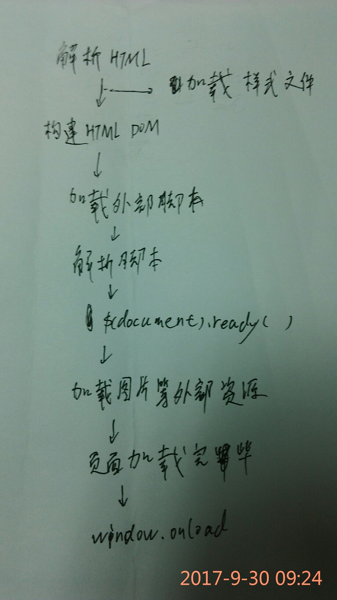

### 1.原生js与jquery对象的互相转换方式分别有哪些,请举例说明

```
var a = document.getElementById('id');
var jq = $(a);

var js = $('#id')[0];

var js = $('#id').get(0);

```

### 2.画图:jquery的ready事件和原生js的window.onload事件,在浏览器中的执行顺序



### 3.如何将一个 HTML 元素添加到 DOM 树中的,写一段实例代码说明？

```
$('#id').append('<h1></h1>');

```

### 4.使用jQuery来提取一个HTML 标记的属性 例如. 链接的href, 写一段代码说明?

```
<a href="https://www.baidu.com/" id="id"></a>

<script type="text/javascript">
console.log($('a').attr('href'));
</script>

```

### 5.jQuery中 detach() 和 remove() 方法的区别是什么?

```
.remove() 将元素移出DOM。 当我们想将元素自身移除时我们用 .remove()，同时也会移除元素内部的一切，包括绑定的事件及与该元素相关的jQuery数据。要删除的元素不删除数据和事件的情况下，使用.detach()来代替。

.detach()保存所有jQuery数据和被移走的元素

```

### 6.如何利用jQuery来向一个元素中添加和移除CSS类?

```
$('#id').addClass('show');

$('#id').removeClass('show');

```

### 7.用jquery实现如下效果

[用jquery实现如下效果](./index-7.html)

### 8.根据注释,使用jQuery为如下页面添加动画效果

[一秒时间去隐藏 4秒去展示出来](./index-8.html)
[渐变，通过淡入的方式显示元素 淡出方式隐藏元素](./index-80.html)
[向下滑动动画显示一个匹配元素 向上滑动 缓慢的隐藏匹配元素](./index-81.html)
